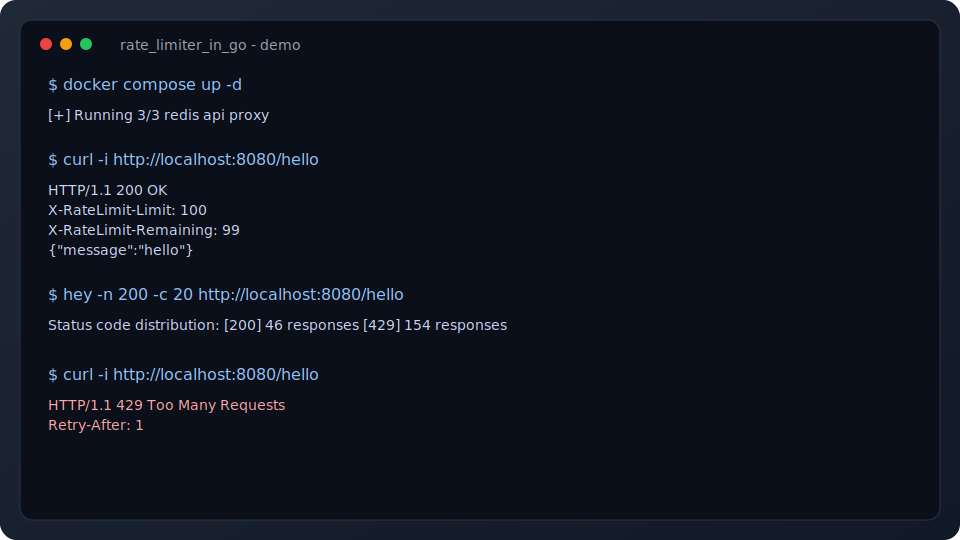
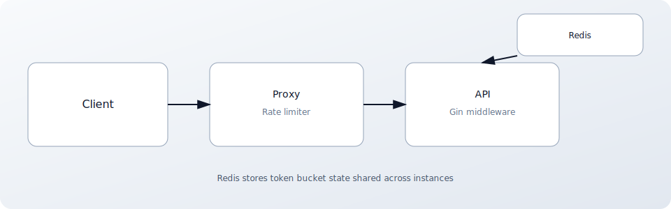

# Rate Limiter in Go (Redis + Gin)

A production-ready distributed rate limiter for APIs using a Redis-backed token bucket.
Includes a Gin middleware and a reverse-proxy sidecar for protecting upstream services.



## Requirements

- Go 1.23+
- Redis 6+
- Docker (optional, for local Redis + proxy)

## Quick start

1) Start the stack (Redis + API + Proxy):

```bash
docker compose up -d
```

2) Call the proxy (rate-limited):

```bash
curl -i http://localhost:8080/hello
```

3) Run locally without Docker (optional):

```bash
go run ./cmd/api
go run ./cmd/proxy
```

## Usage examples

### Curl examples

```bash
# Default key: Client IP or X-API-Key header
curl -i http://localhost:8080/hello

# Use a stable key for tests
curl -i -H "X-API-Key: demo-user" http://localhost:8080/hello
```

Example response headers:

```
HTTP/1.1 200 OK
X-RateLimit-Limit: 100
X-RateLimit-Remaining: 99
X-RateLimit-Reset: 1768835901
```

### Triggering a 429

```bash
hey -n 200 -c 20 http://localhost:8080/hello
```

Expected status code distribution (sample):

```
[200] 46 responses
[429] 154 responses
```

### Run the API directly (without proxy)

```bash
curl -i http://localhost:8081/hello
```

## Configuration (defaults)

- `RATE_LIMIT`: 100 requests
- `WINDOW`: 1m
- `BURST`: 0
- `REDIS_ADDR`: `localhost:6379`
- `FAIL_MODE`: `open` (allow on Redis errors) or `closed`
- `KEY_HEADER`: `X-API-Key`
- `LISTEN_ADDR`: `:8081` (API only)
- `PROXY_LISTEN_ADDR`: `:8080` (proxy only)
- `UPSTREAM_URL`: `http://localhost:8081` (proxy only)

## Project layout

- `cmd/api`: sample Gin API
- `cmd/proxy`: reverse proxy sidecar
- `internal/ratelimiter`: token bucket + Redis Lua
- `middleware/gin`: Gin middleware adapter

## Architecture



## Dependencies

- `github.com/redis/go-redis/v9` for Redis access
- `github.com/gin-gonic/gin` for the sample API and middleware

## Verification

```bash
gofmt -w .
go vet ./...
go test ./...
```

## Integration test (Redis required)

```bash
REDIS_ADDR=localhost:6379 go test ./internal/ratelimiter -run TestRedisLimiterAllow
```
